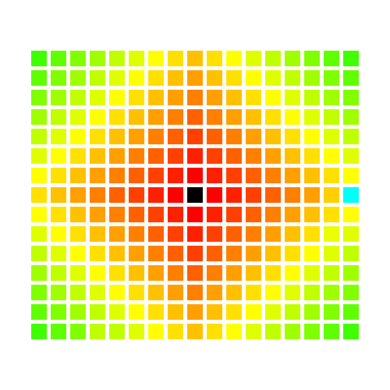
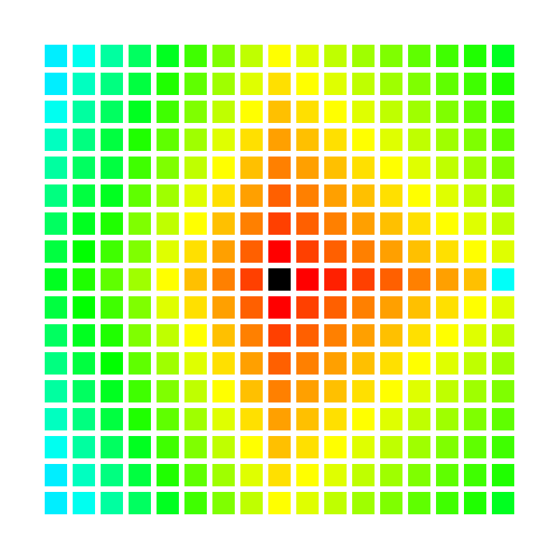

# 🔍 Comparison of Pathfinding Algorithms in Python

> 🇬🇧 English | [🇪🇸 Versión en Español](README.es.md)

## 📌 Description

This project implements and compares two classic pathfinding algorithms: Dijkstra and A*.

The objective is to understand their implementation and analyze their behavior, efficiency, and results when finding the shortest path between two nodes within a graph or map.

## 🧪 Introduction

This project uses the **pygame** library to manage the graphical environment and its visualization.

A map of **ROWS x COLS** is generated, where each cell has a size defined by **CELL**.  
Then the **start** and **goal** positions are randomly selected.

Next, walls (`walls`) are generated randomly with a probability of **30%**. Then, using the `has_path` function, it is checked that there is at least one valid path between **start** and **goal**.

And finally, functions such as `set_speed_9` and `set_speed_99` are included, which randomly assign the speed or cost of each cell.

```
1 Fast - 2 - 3 - 4 - 5 - ... - 99 Slow
```

## 🔦 Dijkstra

This algorithm analyzes each cell by considering the cost or speed associated with it, always exploring the path with the lowest accumulated cost at that moment.

Unlike other search algorithms, **Dijkstra does not use any kind of heuristic** to approach the objective. Instead, it explores the map by gradually expanding the nodes with the lowest total cost from the starting position.

Thanks to this approach, the algorithm guarantees finding **the shortest possible path** between `start` and `goal`. However, since it has no information about the direction of the objective, it may end up exploring a large number of nodes before finding the solution.

### Example

```
 S(0)  A(1)  B(6)
 C(2)  D(4)  E(1)
 F(1)  H(8)  G(2)
```

#### Step 1

It starts at S with accumulated cost 0. S(0)

```
[S(0)]  A(1)  B(6)
 C(2)   D(4)  E(1)
 F(1)   H(8)  G(2)
```

#### Step 2

It analyzes node `S` with accumulated cost **W(S) = 0**.

It calculates the cost of its neighbors:

- W(S -> A) = S(0) + cost(A) -> 0 + 1 = **1**
- W(S -> C) = S(0) + cost(C) -> 0 + 2 = **2**

It chooses **W(S -> A) -> W(SA) = 1**

```
 S(0)  [A(1)]  B(6)
[C(2)]  D(4)   E(1)
 F(1)   H(8)   G(2)
```

#### Step 3

Previous nodes:

- W(S -> C) -> W(SC) = **2**

It analyzes node `A` with accumulated cost **W(SA) = 1**.

It calculates the cost of its neighbors:

- W(SA -> B) = W(SA) + cost(B) -> 1 + 6 = **7**
- W(SA -> D) = W(SA) + cost(D) -> 1 + 4 = **5**

It chooses **W(S -> C) -> W(SC) = 2**

It always chooses the node with the lowest cost, as long as the **node has not been visited**.

```
 S(0)  A(1)  [B(6)]
 C(2) [D(4)]  E(1)
 F(1)  H(8)   G(2)
```

#### Step 4

Previous nodes, ascending order:

- W(SA -> D) -> W(AD) = **5**
- W(SA -> B) -> W(AB) = **7**

It analyzes node `C` with accumulated cost **W(SC) = 2**.

It calculates the cost of its neighbors:

- W(SC -> D) = W(SC) + cost(D) = 2 + 4 = **6**
- W(SC -> F) = W(SF) + cost(F) = 2 + 1 = **3**

It chooses **W(SC -> F) -> W(CF) = 3**

```
 S(0)   A(1)  B(6)
 C(2)  [D(4)] E(1)
[F(1)]  H(8)  G(2)
```

#### Step 5

Previous nodes, ascending order:

- W(SA -> D) -> W(AD) = **5**
- W(SC -> F) -> W(CF) = **6**
- W(SA -> B) -> W(AB) = **7**

It analyzes node `F` with accumulated cost **W(CF) = 3**.

It calculates the cost of its neighbors:

- W(CF -> H) = W(CF) + cost(H) = 3 + 8 = **11**

It chooses **W(SA -> D) -> W(AD) = 5**

```
 S(0)  A(1)  B(6)
 C(2)  D(4)  E(1)
 F(1) [H(8)] G(2)
```

#### Step 6

Previous nodes, ascending order:

- W(SC -> F) -> W(CF) = **6**
- W(SA -> B) -> W(AB) = **7**
- W(CF -> H) -> W(FH) = **11**

It analyzes node `D` with accumulated cost W(AD) = **5**

It calculates the cost of its neighbors:

- W(AD -> E) = W(AD) + cost(E) = 5 + 1 = **6**
- W(AD -> H) = W(AD) + cost(H) = 5 + 8 = **13**

It chooses **W(AD -> E) -> W(DE) = 6**

```
 S(0)  A(1)  B(6)
 C(2)  D(4) [E(1)]
 F(1) [H(8)] G(2)
```

#### Step 7

It reaches node `E`, from which it can reach the final node `G`. The cost is:

- W(DE -> G) = W(DE) + cost(G) = 6 + 2 = **8**.

```
 S(0)  A(1)  B(6)
 C(2)  D(4)  E(1)
 F(1)  H(8) [G(2)]
```

The path found is **W(EG) -> W(DE) -> W(AD) -> W(SA)**

### Dijkstra Heatmap



## ⭐ A* (A-star)

The **A\*** algorithm is an improvement over the Dijkstra algorithm that uses a **heuristic** to estimate the remaining distance to the goal.

At each step, the algorithm evaluates the cells considering two factors:  
- the **accumulated cost** from `start` to the current position  
- an **estimated distance** from that position to `goal`

The sum of these two values allows the algorithm to prioritize the cells that appear to move closer to the goal more quickly. Thanks to this strategy, **A\*** usually explores far fewer nodes than Dijkstra.

If the heuristic used is **admissible** (that is, it does not overestimate the real distance to the goal), the algorithm guarantees finding **the optimal path** between `start` and `goal`.

### A* Heatmap

This is symbolic, since depending on the chosen heuristic the heatmaps may vary.



## ⚖️ Comparison

| Algorithm | Heuristic | Explored nodes | Guarantees optimal path |
|-----------|-----------|----------------|-------------------------|
| Dijkstra  | ❌ No     | High           | ✅ Yes                  |
| A*        | ✅ Yes    | Low            | ✅ Yes (admissible heuristic) |

## 🚀 Execution

Python --version:

```bash
Python 3.X
```

Clone the repository:

```bash
git clone https://github.com/Fren2804/GPS-Python.git
cd GPS-Python
```

Install the environment:

```bash
python3 -m venv .venv
source .venv/bin/activate
python3 -m pip install --upgrade pip
python3 -m pip install pygame
```

Run main.py:

```bash
python3 main.py
```

### Shortcuts

- Escape: Close program
- c: Toggle visualization of cell speeds
- v: Change map speed between v1 and v9/v99
- b: Visualize node exploration with Dijkstra
- g: Visualize path with Dijkstra
- n: Visualize node exploration with A*
- a: Visualize path with A*

## 🎥 Demo Video

[](https://www.youtube.com/watch?v=D4Ks7AKu88U)

## 💻 System

- WSL 2
- Ubuntu-22.04
- Python 3.10.12